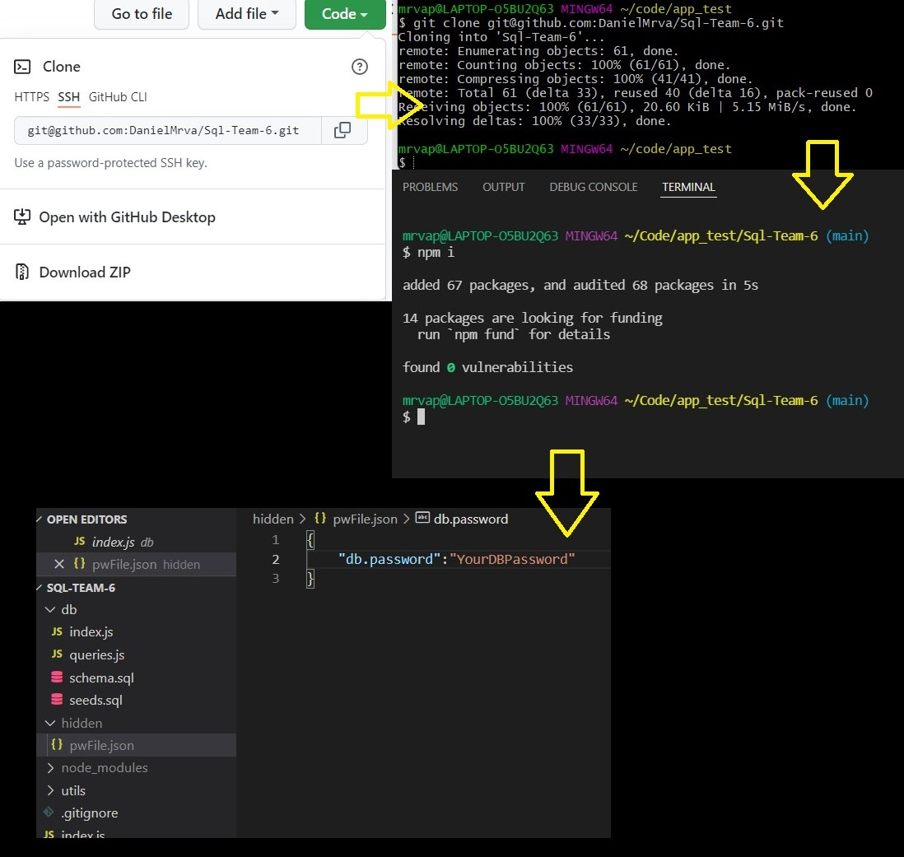
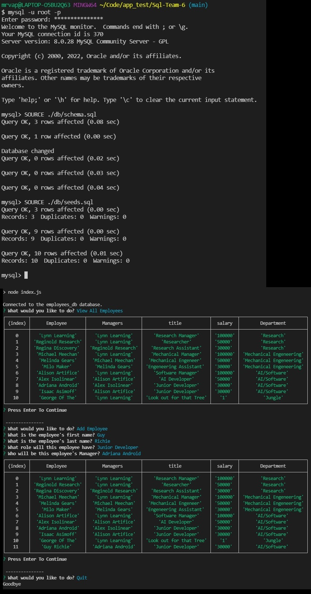

# [Sql_Team_6](https://github.com/DanielMrva/Sql-Team-6) [](https://opensource.org/licenses/MIT)
  
  ## Description
  Sql_Team_6 is a basic command-line employee database access and update app that uses Node JS, Inquirer, MySql2, and Console.Table.

  This app requires the user have access to a [MySql](https://www.mysql.com/) account.

  ## Table of Conents
   1. [Installation](#installation)
   1. [Usage](#usage)
   1. [Contribution](#contribution)
   1. [Acknowledgements](#acknowledgements)
   1. [Questions](#questions)
   1. [Github Repository](#github-repository)
   1. [License](#license)
  
  ## Installation
  Open github link, click on "Code" button, and copy repo link.

  In Bash navigate to desired parent directory and type "git clone" then paste the repo link.

  Open project in Node terminal or code editor terminal and run "npm intall" to install dependencies.

  In your code editor, you will need to create a folder called "hidden" and a json file called "pwFile.json". 
  This will contain your mysql password and keep it off any repositories to which you might push the app.
  The pwFile.json will look like (####### represents your Mysql password):

  ```json
  {"dbPassword": "#########" }
  ```
  This should complete the installation process.

  
  
  ## Usage
  
  In terminal log in to your MySql account and run:

  ```Mysql
  SOURCE ./db/schema.sql;
  USE employees.db;
  ```
  You may also wish to source the seeds.sql file as well to get inital data for testing the app.
  Exit Mysql

  From the app's root directory in Bash or your code editor terminal run "npm start" to run the app. 
  The prompts will guide you through the options avaialbe in the app, or in the questions to add Department, Role, Employee, or to update an Employee.
  Additionally, there is a Quit option to close out the app and bring you back to the command line.

  

  ## Contribution
  Please email any comments or suggestions to my devmail which can be found on my github page.
  
  ## Acknowledgements:
  To my coding buddies for all of their help!

  [Alfred Garraffa](https://github.com/AGarraffa)

  [AmberZimmerman](https://github.com/AmberZimmerman)

  [Lindsey Choi](https://github.com/lindseychoi)
  
  ## Questions
  Devmail

  Feel free to follow or contact me at my GitHub page: [DanielMrva](https://github.com/DanielMrva)
  
  
  ## Github Repository
  [Sql_Team_6](https://github.com/DanielMrva/Sql-Team-6)

  [video](https://watch.screencastify.com/v/5DouxBvx9CNRdEuAK1Zd)
  
  ## License 
  MIT